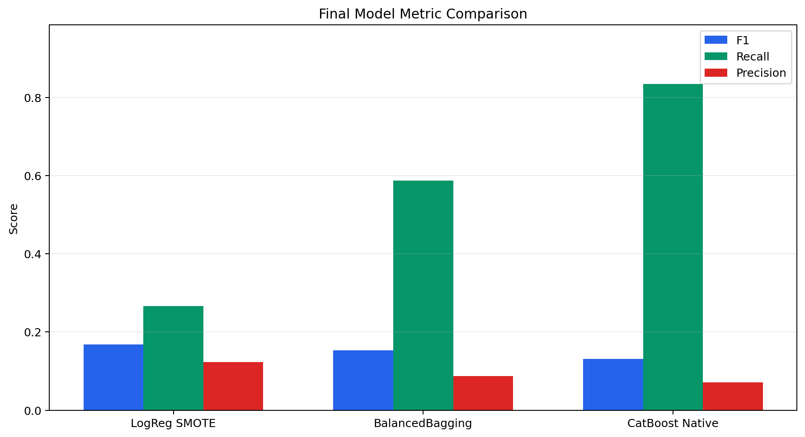
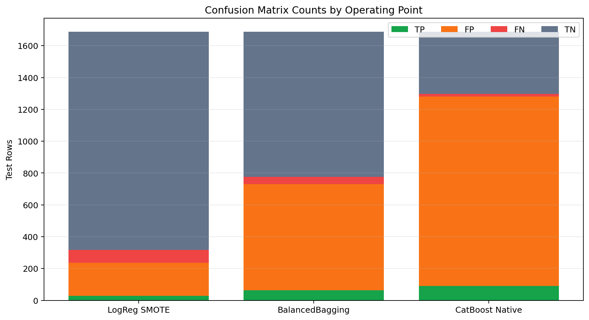
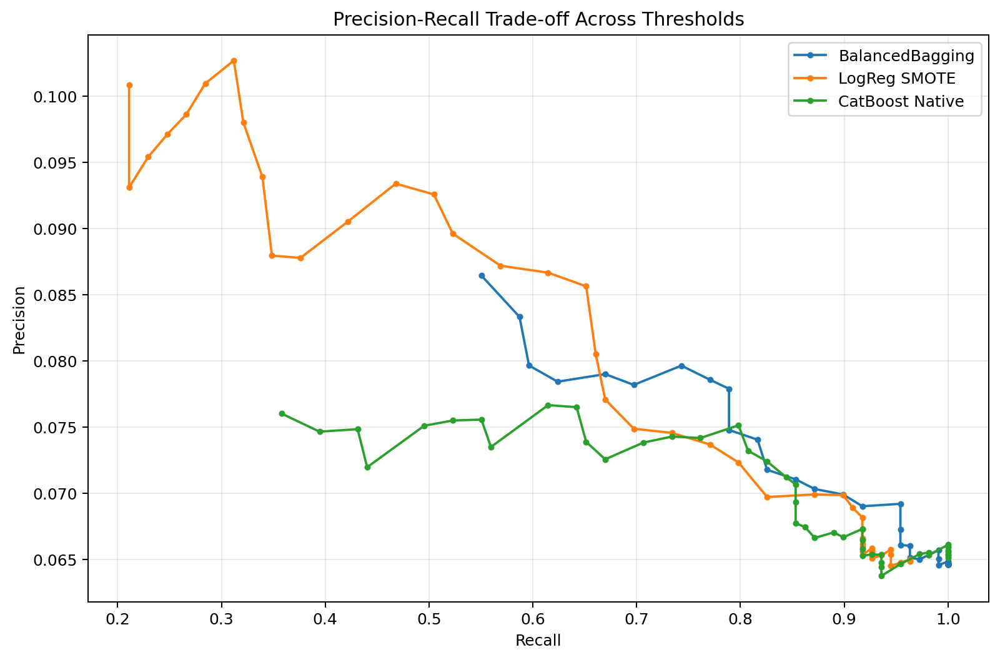
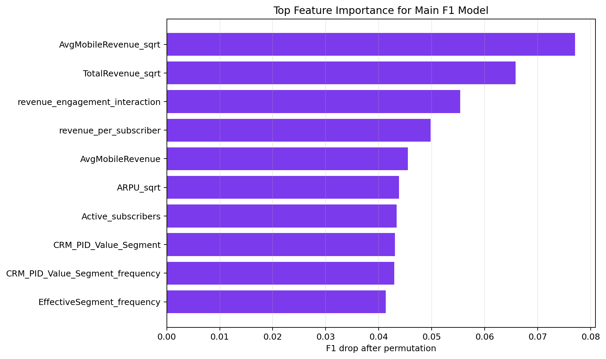
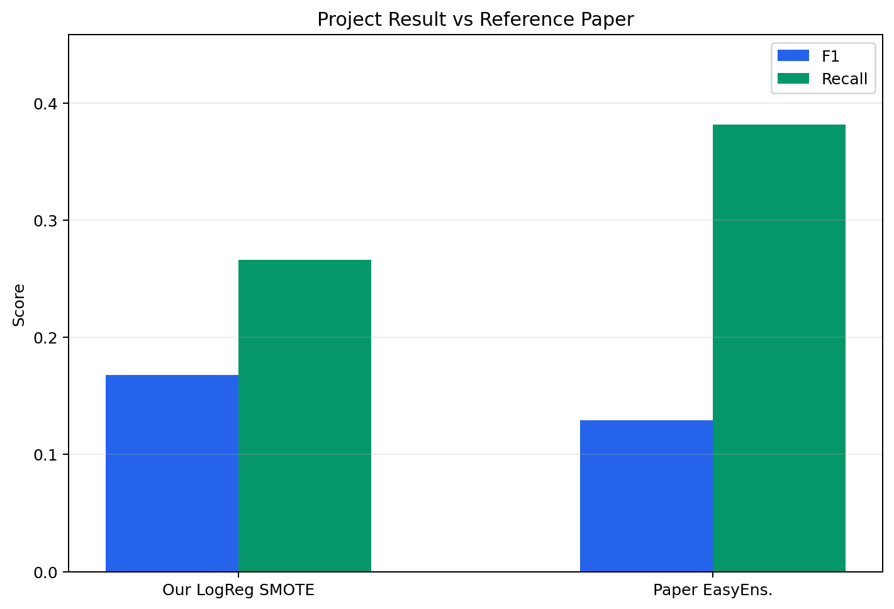

# ChurnRadar 발표 자료 구성안

이 문서는 `FINAL_REPORT.md`를 발표용으로 압축한 슬라이드 구성안입니다. 총 8장 기준이며, 각 슬라이드에는 넣을 핵심 메시지와 사용할 자료를 함께 정리했습니다.

## Slide 1. 프로젝트 주제

제목:

- B2B 통신사 고객 이탈 예측 모델 개발

핵심 메시지:

- 통신사 고객 이탈은 매출 손실과 직접 연결된다.
- 본 프로젝트는 CRM 기반 고객 데이터를 활용해 이탈 가능 고객을 사전에 탐지하는 모델을 만든다.
- 데이터가 매우 불균형하므로 accuracy보다 F1, recall, precision을 중심으로 평가한다.

발표 멘트:

> 이 프로젝트는 통신사 B2B 고객의 이탈 여부를 예측하는 문제입니다. 전체 고객 중 이탈 고객은 약 6.5%뿐이기 때문에, 단순 정확도보다는 실제 이탈 고객을 얼마나 잘 잡는지가 중요합니다.

## Slide 2. 데이터와 문제 정의

넣을 내용:

| 항목 | 값 |
| --- | ---: |
| 원본 데이터 | 8,453 rows x 14 columns |
| 중복 제거 후 | 8,436 rows |
| 이탈 고객 | 549 |
| 비이탈 고객 | 7,904 |
| 이탈 비율 | 약 6.5% |

핵심 메시지:

- target은 `CHURN`이다.
- 이탈 고객이 매우 적은 class imbalance 문제다.
- 따라서 F1, recall, precision, PR-AUC, MCC를 함께 평가했다.

발표 멘트:

> 데이터는 B2B 고객 단위의 CRM snapshot입니다. 이탈 고객 비율이 낮아 accuracy만 보면 모델 성능을 잘못 해석할 수 있으므로, minority class 탐지 성능을 중심으로 평가했습니다.

## Slide 3. 전처리와 Feature Engineering

넣을 내용:

- 중복 PID 제거
- `CHURN` 이진 변환
- 결측 flag 생성
- train 기준 imputation/scaling
- SVMSMOTE 적용
- Billing ZIP 포함/제외 variant 비교
- 가입자 상태 비율, 매출 비율, interaction feature 생성

핵심 메시지:

- 결측 자체도 정보로 보고 missing flag를 추가했다.
- leakage 방지를 위해 imputation과 scaling은 train에만 fit했다.
- 불균형 처리를 위해 SVMSMOTE를 사용했다.

발표 멘트:

> 전처리에서는 결측값을 단순히 채우는 데서 끝내지 않고, 결측 여부 자체를 feature로 남겼습니다. 또한 train set 기준으로만 imputation과 scaling을 fit해서 test leakage를 막았습니다.

## Slide 4. 최종 모델 성능 비교

사용 이미지:

핵심 표:

| 목적 | Model | F1 | Recall | Precision |
| --- | --- | ---: | ---: | ---: |
| F1 기준 최종 모델 | `LogisticRegression_SMOTE` | 0.1681 | 0.2661 | 0.1229 |
| Recall 운영 모델 | `BalancedBagging_original` | 0.1526 | 0.5872 | 0.0877 |
| Recall 극대화 모델 | `CatBoost_native_categorical` | 0.1310 | 0.8349 | 0.0711 |

핵심 메시지:

- F1 기준 최종 모델은 `without_billing_zip + LogisticRegression_SMOTE`이다.
- 이탈 고객을 더 많이 잡으려면 BalancedBagging 또는 CatBoost native를 운영 후보로 쓸 수 있다.

발표 멘트:

> 최종 F1 기준으로는 LogisticRegression_SMOTE가 가장 좋았습니다. 하지만 recall을 높이는 목적이라면 BalancedBagging이나 CatBoost native가 더 많은 이탈 고객을 잡습니다.

## Slide 5. Confusion Matrix 기반 운영 해석

사용 이미지:

핵심 메시지:

- LogisticRegression은 false positive가 상대적으로 적다.
- BalancedBagging은 더 많은 churn 고객을 잡지만 false positive도 늘어난다.
- CatBoost native는 recall이 가장 높지만 캠페인 비용 부담이 커질 수 있다.

발표 멘트:

> 모델 선택은 단순히 점수 하나로 정하기보다 운영 목적에 따라 달라집니다. retention campaign에서 false positive 비용이 낮다면 recall 중심 모델도 의미가 있습니다.

## Slide 6. Threshold Trade-off

사용 이미지:

핵심 메시지:

- threshold를 낮추면 recall은 증가하지만 precision은 감소한다.
- validation에서 threshold를 선택하고 test에 한 번만 적용했다.
- threshold tuning은 최종 F1 1등을 바꾸지는 못했지만, 운영 가능한 recall-heavy 지점을 만들었다.

발표 멘트:

> 불균형 문제에서는 기본 threshold 0.5가 항상 최선이 아닙니다. 본 프로젝트에서는 validation set에서 threshold를 탐색해 운영 목적별 선택지를 만들었습니다.

## Slide 7. Feature Importance

사용 이미지:

핵심 메시지:

- 주요 신호는 매출 규모와 가입자 활동성이다.
- `AvgMobileRevenue_sqrt`, `TotalRevenue_sqrt`, `revenue_engagement_interaction`이 중요했다.
- 이탈은 단순 고객 segment보다 revenue와 engagement의 결합 신호에서 더 잘 드러났다.

발표 멘트:

> Feature importance를 보면 매출 관련 변수와 가입자 활동성의 상호작용이 중요하게 나타났습니다. 이는 이탈 위험이 단순한 고객 등급보다 실제 사용/매출 패턴과 더 밀접하다는 점을 보여줍니다.

## Slide 8. 논문 비교, 한계, 결론

사용 이미지:

논문 비교:

| 기준 | Model | F1 | Recall | Precision |
| --- | --- | ---: | ---: | ---: |
| 참고 논문 | EasyEnsemble | 0.1290 | 0.3820 | 0.0770 |
| 본 프로젝트 F1 최종 | LogisticRegression_SMOTE | 0.1681 | 0.2661 | 0.1229 |
| 본 프로젝트 recall 운영 | BalancedBagging_original | 0.1526 | 0.5872 | 0.0877 |

최종 결론:

- 최종 모델은 `without_billing_zip + LogisticRegression_SMOTE`이다.
- 운영 목적에 따라 recall 중심 모델을 별도로 선택할 수 있다.
- 현재 데이터는 static CRM snapshot이라 시간 기반 행동 feature가 부족하다.

향후 개선:

- 월별 사용량 변화
- 결제 실패 이력
- 고객센터 문의/불만 이력
- 계약 만료 정보
- 최근 매출 감소 추세

발표 멘트:

> 논문과 비슷하게 불균형 처리와 ensemble 모델을 실험했지만, 본 프로젝트에서는 F1 기준 LogisticRegression_SMOTE가 가장 적합했습니다. 다만 성능 상한은 데이터 특성의 영향을 크게 받기 때문에, 향후에는 시간 기반 고객 행동 데이터를 추가하는 것이 가장 중요합니다.

## 발표용 한 문장 결론

> 본 프로젝트에서는 B2B 통신사 고객 이탈 예측을 위해 불균형 전처리, SVMSMOTE, ensemble 모델, CatBoost native categorical 처리, threshold tuning, 오류 분석을 수행하였다. 최종적으로 F1 기준 모델은 `LogisticRegression_SMOTE`이며, recall 중심 운영 목적에서는 `BalancedBagging_original`과 `CatBoost_native_categorical`이 보조 후보가 될 수 있다.

